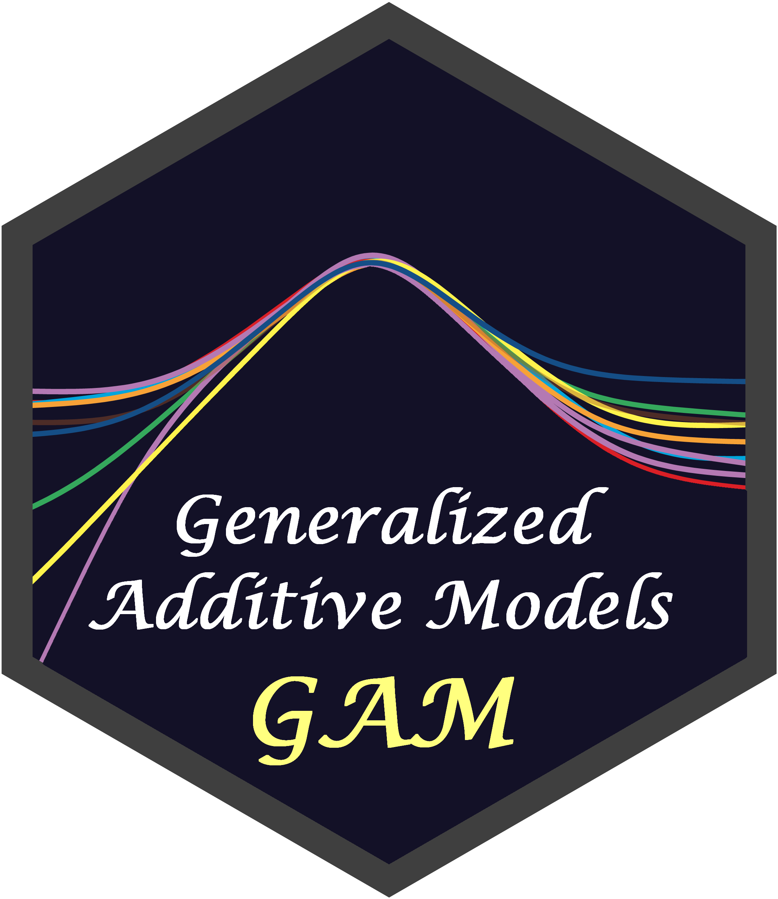

<!-- README.md is generated from README.Rmd. Please edit that file -->

# Bindings for Additive TidyModels 

<!-- badges: start -->

<!-- badges: end -->

[**`additive`**](https://hsbadr.github.io/additive/) supports
Generalized Additive Models (GAM) using
[`mgcv`](https://cran.r-project.org/package=mgcv) with
[`parsnip`](https://parsnip.tidymodels.org/)/[`tidymodels`](https://www.tidymodels.org/).

## Installation

The stable version of [`additive`](https://hsbadr.github.io/additive/)
can be installed from
[CRAN](https://CRAN.R-project.org/package=additive) using:

    install.packages("additive")

The development version of
[`additive`](https://hsbadr.github.io/additive/) can be installed from
[GitHub](https://github.com/hsbadr/additive) using:

    install.packages("pak")
    pak::pkg_install("hsbadr/additive")

## Example

    library(additive)

    set.seed(2020)
    dat <- gamSim(1, n = 400, dist = "normal", scale = 2)

    additive_mod <-
      additive() |>
      set_engine("mgcv") |>
      fit(
        y ~ s(x0) + s(x1) + s(x2) + s(x3),
        data = dat
      )

    summary(additive_mod$fit)

For more details, [get started with
`additive`](https://hsbadr.github.io/additive/articles/GetStarted.html).

## Citation

To cite `additive` in publications, please use:

    citation("additive")

> Hamada S. Badr (2024): additive: Bindings for Additive TidyModels,
> [*Comprehensive R Archive Network
> (CRAN)*](https://cran.r-project.org/package=additive). URL:
> <https://hsbadr.github.io/additive/>.

## Contributing

This project is released with a [Contributor Code of
Conduct](https://contributor-covenant.org/version/2/0/CODE_OF_CONDUCT.html).
By contributing to this project, you agree to abide by its terms.

-   For questions and discussions about tidymodels packages, modeling,
    and machine learning, please [post on RStudio
    Community](https://forum.posit.co/).

-   If you think you have encountered a bug, please [submit an
    issue](https://github.com/hsbadr/additive/issues).

-   Either way, learn how to create and share a
    [reprex](https://reprex.tidyverse.org) (a minimal, reproducible
    example), to clearly communicate about your code.

-   Check out further details on [contributing guidelines for tidymodels
    packages](https://www.tidymodels.org/contribute/) and [how to get
    help](https://www.tidymodels.org/help/).
